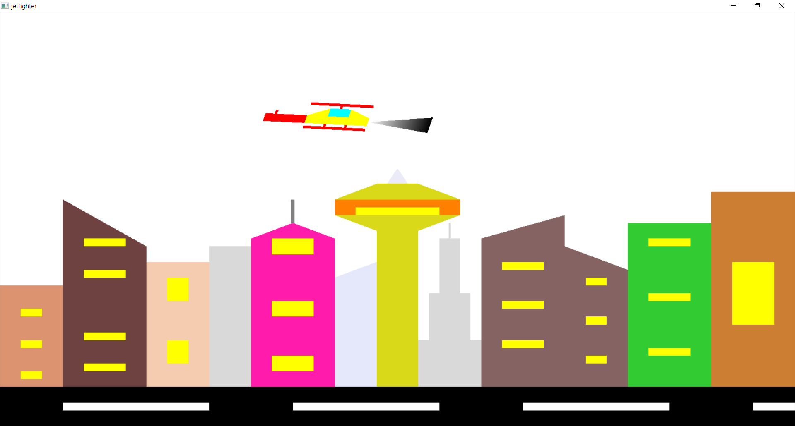
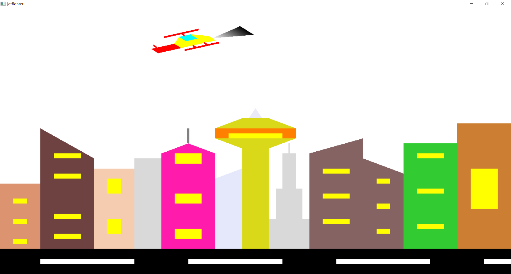
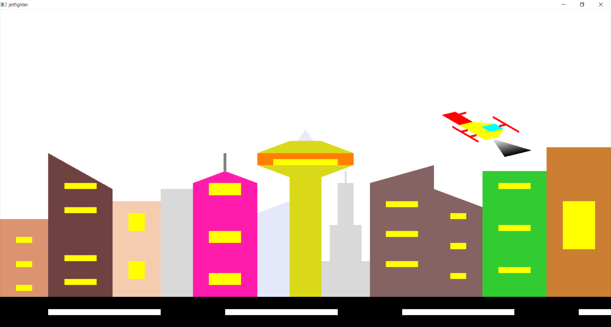
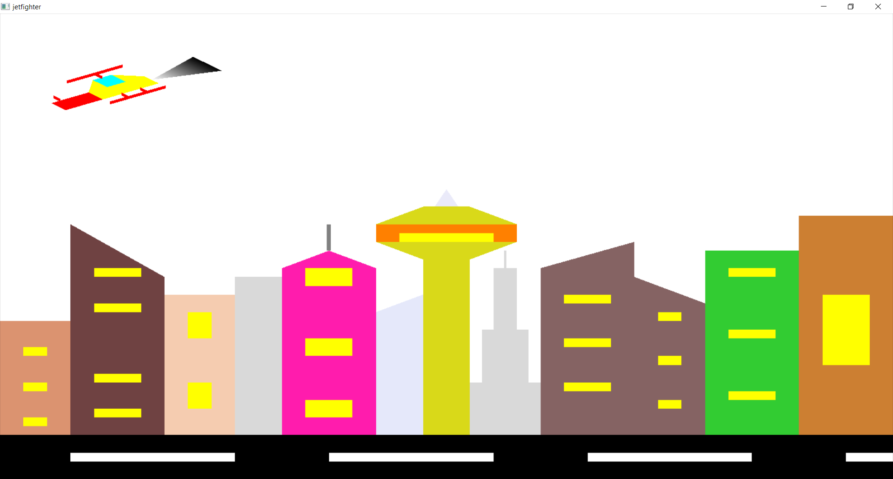
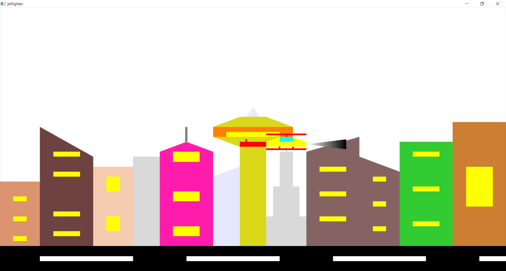

# CGV-Assignment-Fighter-Jet
CGV Assignment - Somil Jain (1BY18CS167)

# 1. Introduction
This project is an animated interactive interface where it simulates the movement of the Helicopter in the war scene and also enables it to shoot the bullets for a specific time. The user can also control the movement of the Helicopter and to shoot the bullets using the keyboard keys such as ‘S’ or space bar to shoot the bullets and up key to increase the speed of the Helicopter and left key to rotate the Helicopter upwards and right key to rotate the Helicopter downwards and by pressing the key ‘p’ to pause the scene and to replay the scene from the same time and the same place from where the Helicopter was freezed .By pressing the key ‘Q’ it quits the scene. It also has a static city background scene. This software makes use of the OpenGL Framework for graphics that are provided and it is coded in C language.

# 1.1 Brief Introduction
The main theme of this project is to display the Helicopter flying from one end to another end or to reach the destination successfully with basic computer graphics. This graphics package is based on the OpenGL library functions. The programming language used here is C using OpenGL libraries.

# 1.2 Motivation
The cities of India, especially the metro cities are always threatened and are always a potential spot for a terrorist attack. While the Indian Air force and army always try to avoid and fight for these attacks. Helping our country with such fighter jets will help us to carry our duty which will help us to stay safe.

In doing so we should be able to ensure no casualties occur during the fight which will help people to stay safe and live with their family happily and safely.

# 3. System Requirement

# 3.1 Hardware Requirement
1. CPU: Intel/AMD CPU 
2. RAM (Main memory): 512 MB 
3. Hard disk: 10MB of free space 
4. Hard disk speed (in RPM): 5400 RPM 
5. Mouse: 2 button mouse 
6. Keyboard: Standard keyboard with arrow keys 
7. Monitor: 1366*768 display resolution 

# 3.2 Software Requirements
1. Operating System: Windows Based Operating System (64 bit)
2. Code::Blocks with OpenGL and SOIL libraries 
3. Mouse driver 
4. Graphic driver

# 4. Implementation

# 4.1 Ideology

The goal of this game is to fly as far as possible, with only two controls at your disposal, this is one of those “easy to learn, difficult to master” situations. You’ll first select a plane and a scene. 

# 4.2 API’s Used
The following APIs have been used in this project. The API name along with its description is as follows:

1. glutMainLoop(void);
It causes the program to begin an event-processing loop.
2. glutReshapeFunc(void (GLUTCALLBACK *func)(int width, int height));
The reshape event is generated whenever the window is resized, such as by a user interaction.
3. glPushMatrix();
Set current matrix on the stack
3. glPopMatrix();
Pop the old matrix without the transformations.
4. void glTranslatef(GLfloat x, GLfloat y, GLfloat z);
glTranslate produces a translation by (x, y, z ).
5. void glLineWidth(GLfloat width);
Specifies the rasterized width of both aliased and antialiased lines.
6. void glutSpecialFunc(void (*func)(int key, int x, int y));
Sets the special keyboard callback for the current window.
7. void glutMainLoop(void);
Enter the GLUT event processing loop. This routine should be called at most once in a GLUT program.
8. glMatrixMode (GLenum mode);
It switches matrix mode between the two matrices – • MODEL_VIEW (GL_MODELVIEW) • PROJECTION (GL_PROJECTION)
9. glOrtho (GLdouble left, GLdouble right, GLdouble bottom, GLdouble top, GLdouble zNear, GLdouble zFar);
It establishes as a view volume a parallelepiped that extends from left to right in x, bottom to top in y and near to far in z.
10. glVertex3f (GLfloat x, GLfloat y, GLfloat z);
It is used to represent vertex.
11. glViewport (GLint x, GLint y, GLsizei width, GLsizei height);
It specifies that the viewport will have lower left corner (x,y) in screen coordinates and will be width pixels wide and height pixels high.
12. glutCreateWindow(const char *title);
It creates and opens an OpenGL window with the title passed as the argument.
13. glutDisplayFunc(void (GLUTCALLBACK *func)(void));
It sends graphics to the screen.
14. glutIdleFunc(void (GLUTCALLBACK *func)(void));
It is used to increase theta by a fixed amount whenever nothing else is happening.
15. glutInit(int *argcp, char *argv);
It initiates interaction between the windowing system and OpenGL.
16. glutInitDisplayMode(unsigned int mode);
This function specifies how the display should be initialized. The constants GLUT_SINGLE and GLUT_RGB, which are ORed together, indicate that a single display buffer should be allocated and the colors are specified using the desired amount of red, green and blue.
17. glutKeyboardFunc(void (GLUTCALLBACK *func)(unsigned char key, int x, int y));
The keyboard event is generated when the mouse is in the window and one of the keys is pressed or released. This GLUT function is the call back for events generated by pressing a key.

# 5. Screenshots

Figure 5.1

Figure 5.2

Figure 5.3

Figure 5.4

Figure 5.5

# 6. Notes
Implemented using C++ and OpenGL.

# 7. Bibliography

7.1. Books referred:
Edward Angel: Interactive Computer Graphics: A Top-Down Approach with OpenGL, 5th Edition, Pearson Education, 2008.

7.2. Other Webpages:
freeglut.sourceforge.net/
Opengl.org/documentation/
Opengl.org/discussion_boards/
Opengl-tutorial.org
Nehe.gamedev.net/
